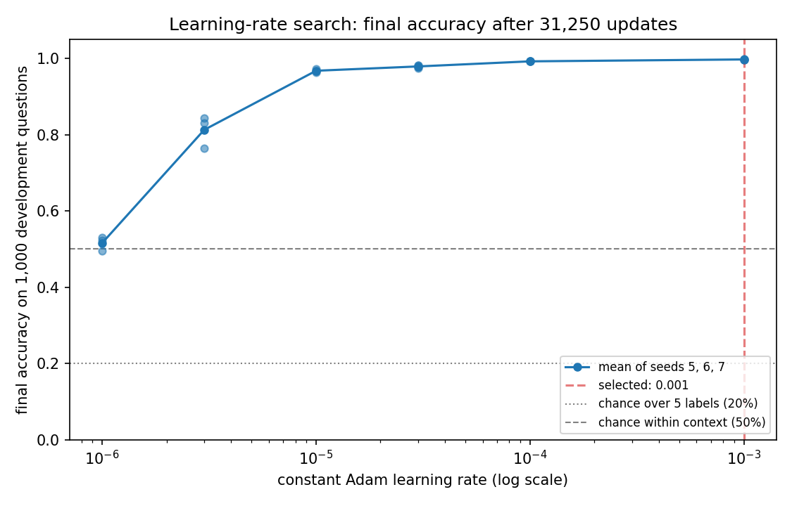

# Finding 01 — Learning rate 0.001 performed best among the tested settings

15–16 September 2026 | source runs: `results/base_task/tuning/`

## Question

Earlier work used the authors' learning rate, 1e-5. Before committing to a chain
of recursive generations — where every generation must share one fixed training
setting — we measured how several learning rates perform **under our fixed
settings and training budget** of 1,000,000 sequences (31,250 updates).

## Setup

A grid of **six learning rates × three initialisation seeds = 18 models**:

- learning rates 1e-6, 3e-6, 1e-5, 3e-5, 1e-4, 1e-3
- initialisation seeds 5, 6, 7

The learning rate is what is being compared. The three seeds are repeated
starting conditions: they give a limited picture of how much results vary with
initialisation, from three samples.

Every candidate trains on the **original** task with **true** query targets — no
generated data in this stage. Architecture, optimizer (constant-rate Adam), batch
size 32 and the training-data seed are identical across all 18, so every
candidate sees the same 1,000,000 questions in the same order. Each trains for
exactly one pass from fresh weights and a fresh optimizer, and the **final**
checkpoint is what gets compared: no early stopping and no best-checkpoint
picking.

**Decision rules recorded before the results they applied to were inspected:**
the selection rule — highest mean accuracy over the three seeds, compared
unrounded, an exact tie broken by lowest mean loss, a remaining tie preferring
1e-5 and otherwise the smaller rate, with any rate missing a seed excluded
rather than averaged over a subset — and the evaluator seeds. The protocol as a
whole was not fixed in advance: the evaluator changed and a sixth rate was added
partway through, as described next.

### How the search actually developed

1. The first five rates (1e-6 to 1e-4) were run and scored on a
   **10,000-question** development evaluator.
2. Those 15 final models were then **freshly re-scored** on the existing
   **1,000-question** evaluator, to see whether the smaller set gave the same
   answer.
3. It did, so the project adopted the 1,000-question evaluator throughout and
   retired the larger one.
4. **1e-3 was added afterwards**, because the winner of the first five sat at the
   top of that range. It was trained and scored on the 1,000-question evaluator
   only, and was never scored on 10,000 questions.

The search then stopped. 3e-4 and rates above 1e-3 were not tested.

## Results



Mean final accuracy on the 1,000 development questions, across seeds 5, 6, 7.
The spread column is the **population** standard deviation of three values, not
a confidence interval:

| learning rate | mean accuracy | spread (pop. sd) | mean loss | seed 5 | seed 6 | seed 7 |
| --- | ---: | ---: | ---: | ---: | ---: | ---: |
| 1e-6 | 0.5157 | 0.0150 | 0.7593 | 0.530 | 0.495 | 0.522 |
| 3e-6 | 0.8127 | 0.0349 | 0.4135 | 0.844 | 0.764 | 0.830 |
| 1e-5 (authors') | 0.9677 | 0.0033 | 0.0928 | 0.967 | 0.972 | 0.964 |
| 3e-5 | 0.9790 | 0.0036 | 0.0822 | 0.974 | 0.981 | 0.982 |
| 1e-4 | 0.9923 | 0.0005 | 0.0278 | 0.992 | 0.992 | 0.993 |
| **1e-3** | **0.9973** | 0.0009 | **0.0099** | 0.996 | 0.998 | 0.998 |

**Selected learning rate: 1e-3.** All 18 candidates trained to completion; none
diverged, and every loss stayed finite.

Mean accuracy increased across the tested rates, with much smaller gains toward
the upper end: 1e-6 → 1e-5 gains 45.2 percentage points, while 1e-5 → 1e-3 gains
3.0. The adjacent gains are not monotonically decreasing — in percentage points
they run 29.7, 15.5, 1.13, 1.33, 0.50, so the step into 1e-4 is slightly larger
than the step before it. The tested rates are unevenly spaced, so these are
observed gains between the settings tried rather than a characterised curve.

Mean loss also falls across the range, from 0.0928 at 1e-5 to 0.0099 at 1e-3 —
that is, the higher-rate models assign a higher geometric-mean probability to
the correct label. This is a lower predictive loss on average; it is not a
measurement of calibration, and it does not mean every individual prediction is
more confident.

The seed spread does **not** shrink monotonically: it rises from 0.0150 at 1e-6
to 0.0349 at 3e-6 before falling, and rises again slightly from 0.0005 at 1e-4
to 0.0009 at 1e-3. What does hold across the table is that the gap between each
adjacent pair of rates is larger than the spread across the three seeds at
either of them.

The reserved final-test classes were not generated and not scored.

## Interpretation

**Under our fixed settings and budget, 1e-3 reached higher final development
accuracy than 1e-5: 0.9973 against 0.9677, with mean loss 0.0099 against
0.0928.** That is a comparison of measured outcomes in this configuration. We
make no claim about why the authors chose their rate, what they were optimising
for, or how these rates would compare under different settings.

The 1e-6 result is consistent with **insufficient learning within this budget**
rather than divergence: losses stayed finite and were still falling at the end,
and final accuracy was near 50%. Its behaviour was also measured directly — at
seed 5, restricting predictions to the two labels present in the context left
accuracy unchanged (0.530 either way), and 96.6% of probability mass sat on
those two labels. That is a strong preference for the context labels, not
exclusive prediction of them: a few percent of mass still went elsewhere. It had
learned to answer largely within the context without reliably picking the right
one of the two. Whether it would reach higher
accuracy with a longer budget was not tested.

**The winner is at the edge of the tested range.** The correct description is
*best among the tested rates under this training budget* — not the best learning
rate. Nothing here rules out a better rate above 1e-3, or instability above it.

## Note: the evaluator-size comparison

The 15 models from the original five-rate search were scored on both evaluators.
The two agreed on the **ranking of those five rates and on the winner**, and on
14 of the 15 individual models the two scores were within 1.1 percentage points.

That is agreement for those 15 models. It does not establish that a
1,000-question evaluator is generally precise enough for any comparison, and it
says nothing about the 1e-3 candidates, which were never scored on 10,000
questions.

Measurements: `results/base_task/tuning/evaluator_comparison.json` and
`results/base_task/tuning/evaluator_size_comparison.png`, both covering the
original 15 models only.

## Limitations

- **Boundary result.** 1e-3 is the top of the tested range and the search stopped
  there. 3e-4 and rates above 1e-3 were not tested.
- **One budget.** Every result is specific to 31,250 updates.
- **Three initialisations, one development set.** Uncertainty about other seeds
  and other evaluation samples remains unquantified.
- **Selection used final checkpoints only.** Accuracy and loss *were* logged
  throughout training — 201 evaluation points per candidate in each `log.h5` —
  so learning curves are available. What tuning candidates lack is intermediate
  *weights*: they save only the first and last checkpoint, which limits
  retrospective mechanistic analysis, not analysis of the logged metrics.
  Generation 0 of the recursive experiment was therefore trained separately at
  1e-3 under the 55-checkpoint policy rather than reused from the search; see
  `findings/02_recursive_generations.md`.

## Reproduce

From the project root, with the environment set up (see README):

```powershell
.\.venv\Scripts\python.exe scripts/prepare_evaluation_data.py
.\.venv\Scripts\python.exe scripts/base_task/tune_learning_rate.py
```

The tuning command trains any candidate without a result, scores each final
checkpoint on the 1,000-question set, applies the selection rule and writes the
figure. Finished candidates are skipped, so it is safe to stop and restart.

Measurements and figure:

- `results/base_task/tuning/results.json` — all 18 candidates: learning rate,
  seed, run path, accuracy and loss
- `results/base_task/tuning/selection.json` — the selection rule, per-rate
  summaries, the winning rate and the chosen checkpoint
- `results/base_task/tuning/learning_rate_comparison.png` — the figure above

**What this selects for the recursive experiment:** learning rate 1e-3 at
initialisation seed 5. Seed 5 was fixed in advance as the seed carried forward.
It is not the best-scoring seed — seeds 6 and 7 both reached 0.998 against seed
5's 0.996 — and was deliberately not chosen on performance.

The tuning candidate itself
(`results/base_task/tuning/learning_rate_0.001_init_seed_5/`) keeps only its
first and last checkpoint, so generation 0 was retrained with the same settings
under the 55-checkpoint policy. `findings/02_recursive_generations.md` reports
that the retrained model matched this candidate's accuracy.
