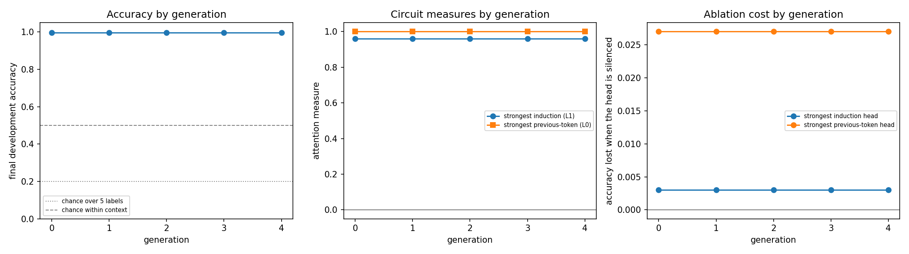

# Finding 02 — Label-only recursion preserved the model across generations 0–4

16 September 2026 | source runs: `results/base_task/recursive/`

## Question

Does induction-circuit function weaken across recursive generations *before*
overall prediction accuracy declines?

## Setup

Five models in one chain. Generation 0 is trained on the real task; each of
generations 1–4 is trained on the previous generation's own answers.

All five share every setting except how the training targets were produced:
learning rate 1e-3 (finding 01), initialisation seed 5, batch size 32,
1,000,000 sequences = 31,250 updates, the same training-data seed, and the same
architecture and optimizer. Each successor starts from **fresh weights and a
fresh optimizer**, never from the parent's weights.

For each successor, 1,000,000 questions are drawn from the *original* training
distribution — same 50 classes, same context construction, correct context
labels — and the parent's **argmax over all five labels** replaces only the
query's answer. No true targets are mixed in.

All five are scored on the same fixed 1,000-question development evaluator,
built from 100 classes no training run ever sees. All five save 55 checkpoints.
The reserved final-test classes were never generated or scored.

## Results

### Generation 0 reproduced the tuning result

Development accuracy 0.9960 and loss 0.0114 — matching the learning-rate
search's record for the same configuration. It also scored **100% on
`fsl_train`**, the 1,000-sequence evaluator drawn from the training
distribution, and 100% on held-out label pairings.

`fsl_train` is a finite sample. Scoring 100% on it is not a measurement of
accuracy over every question the distribution can produce.

### The parent's answers matched the true answers on every generated example

| Generation | Parent answers differing from the true answer, of 1,000,000 | Answers outside the context |
| --- | ---: | ---: |
| 1 | **0** | 0 |
| 2 | **0** | 0 |
| 3 | **0** | 0 |
| 4 | **0** | 0 |

Each successor's dataset contains 78,400 distinct questions across its million
examples (recorded in `generation_metadata.json`). We did not measure how many
distinct questions the distribution can produce, so this is a coverage count,
not a proof of exhaustive coverage.

### Generation 0 and its successors trained on matching examples

The two training paths differ in *how* targets were obtained: generation 0 takes
the true label from the sampler as each batch is drawn, while a successor reads
a saved dataset whose query targets came from running the parent. In these runs
the resulting target **values** were identical, because the parent's answer
matched the true answer on every example.

The questions and their order also match: the successor pipeline draws its
questions from the same training key chain as generation 0, and an earlier check
confirmed that this reconstruction reproduces the authors' sampler output for the
batches inspected. Generation 0's training data is generated on the fly and never
written to disk, so no byte-level comparison of the two datasets was possible;
the match rests on shared construction plus that spot check.

### The five models are equal where we compared them

| What was compared | Result |
| --- | --- |
| Generation 0 vs generation 1, final parameters | L2 difference **exactly 0** (weight norm 42.8) |
| Generations 1–4, final checkpoint files | byte-identical to one another |
| Generations 1–4, initial checkpoint files | byte-identical to one another |

Generation 0's checkpoint *files* differ from the successors' because the two
code paths store different optimizer and PRNG state, even though the final
parameters are equal. The 55 intermediate checkpoints of each model were **not**
compared against each other; the equality above covers the final parameters and
the two endpoint files.

Every quantity we measured is flat across the chain:



| Generation | Dev accuracy | Dev loss | Strongest induction score | Strongest previous-token score | Accuracy lost ablating the induction head | ...the previous-token head |
| --- | ---: | ---: | ---: | ---: | ---: | ---: |
| 0 | 0.9960 | 0.0114 | 0.9596 | 0.9999 | 0.3 pp | 2.7 pp |
| 1 | 0.9960 | 0.0114 | 0.9596 | 0.9999 | 0.3 pp | 2.7 pp |
| 2 | 0.9960 | 0.0114 | 0.9596 | 0.9999 | 0.3 pp | 2.7 pp |
| 3 | 0.9960 | 0.0114 | 0.9596 | 0.9999 | 0.3 pp | 2.7 pp |
| 4 | 0.9960 | 0.0114 | 0.9596 | 0.9999 | 0.3 pp | 2.7 pp |

Heads were selected from **each model's own final scores**, never inherited. The
same indices came out every time (induction L1H2, previous-token L0H7).

### Attention measurements and ablation effects at 1e-3

Measured on generation 0, and identical in all five. These are
**attention-pattern measurements**: they describe where heads attend, not what
each head contributes to the output.

- **Seven of eight layer-1 heads** have a positive induction score, the
  strongest 0.9596; only L1H6 is negative (−0.0615).
- Two layer-0 heads have near-maximal previous-token scores (L0H7 at 0.9999,
  L0H4 at 0.9965).

Zeroing one head's value vectors, measured on the development evaluator:

| Intervention | Accuracy | Change |
| --- | ---: | ---: |
| intact | 0.9960 | — |
| strongest induction head (L1H2) silenced | 0.9930 | −0.3 pp |
| weakest layer-1 head (L1H6) silenced | 0.9960 | 0.0 pp |
| strongest previous-token head (L0H7) silenced | 0.9690 | −2.7 pp |

These are the effects of those specific single-head interventions on this
evaluator. They do not measure the importance of the induction circuit as a
whole, and a small effect does not by itself establish redundancy: other heads
compensating for the silenced one is a possible explanation, and it was not
tested here.

### Within training

Using generation 0's analysed checkpoints — **13 of the 55 saved** — accuracy
sits near the 50% in-context chance level through 40,000 sequences, then reaches
96.4% by 80,000. Both attention measures rise inside that same interval:
induction 0.036 → 0.830, previous-token 0.070 → 0.941.

The two analysed points spanning the transition are **40,000 sequences apart**,
so the order in which the two measures changed is unresolved at the points
examined. Denser checkpoints exist on disk if a finer scan is wanted.

## Interpretation

**The chain was stable: none of the quantities we measured changed across
generations 0–4.** That covers the final parameters wherever we compared them,
the development scores, the two attention measures and the four head ablations —
not every property of these models. The experiment therefore did not establish
whether circuit function weakens before accuracy, because neither declined.

The reason is specific to how this chain was run. The input construction, the
data order, the initialisation and the optimisation were all held fixed across
generations, so the only thing that could differ between a successor's training
and generation 0's was the query targets — and on every generated example the
parent's answer matched the true one. With nothing varying, training reached the
same parameters.

This says what happened in this configuration. It does not show that label-only
recursion cannot degrade a model in general, and it does not predict what more
generations under these same conditions would produce.

On the mechanism, the supported statement is narrower than the attention scores
alone suggest: the strongest induction head has a near-maximal pattern score
(0.9596), yet silencing it changed accuracy by 0.3 percentage points on this
evaluator. A high pattern score alone does not establish that a head is causally
important for the measured behaviour.

## Limitations

- **One chain, and one in which nothing varied.** Five models whose final
  parameters were equal wherever compared. Not a sample of independent chains.
- **Coverage is a count, not a proof.** 78,400 distinct questions appeared in
  each dataset; we did not establish what the distribution can produce.
- **Ablation is single-head and zero-ablation only**, on four of sixteen heads,
  measured on one evaluator.
- **Within-training ordering is unresolved** at the 13 analysed checkpoints,
  where the transition falls in a 40,000-sequence gap.
- The reserved final-test classes have never been scored.

**Next step.** We intend to discuss the extended task, in which the model also
predicts a following symbol and its label. Because generated symbols can change
the input distribution — not only the targets — it offers a route to conditions
where successors differ from their parent. Whether that produces drift is an
open question, and any alternative condition needs its own scientific
justification rather than being chosen to make degradation more likely.

## Reproduce

From the project root, with the environment set up (see README):

```powershell
.\.venv\Scripts\python.exe scripts/base_task/train_original.py --results-subfolder recursive --run-name generation_0 --learning-rate 0.001 --init-seed 5
.\.venv\Scripts\python.exe scripts/base_task/run_recursive.py --parent results/base_task/recursive/generation_0 --generations 4
.\.venv\Scripts\python.exe scripts/base_task/analyse_runs.py results/base_task/recursive/generation_0
.\.venv\Scripts\python.exe scripts/base_task/analyse_runs.py --compare results/base_task/recursive
```

Run the per-run analysis once for each generation before the comparison.

Measurements and figures:

- `results/base_task/recursive/generation_comparison.json` and
  `generation_comparison.png` — the across-generation table and figure
- `results/base_task/recursive/generation_<n>/analysis/` — per-generation
  `analysis.json`, learning curves, per-head measures and attention map
- `results/base_task/recursive/generation_<n>/generation_metadata.json` —
  successors only: parent checkpoint, generation rule, target quality, worked
  examples
