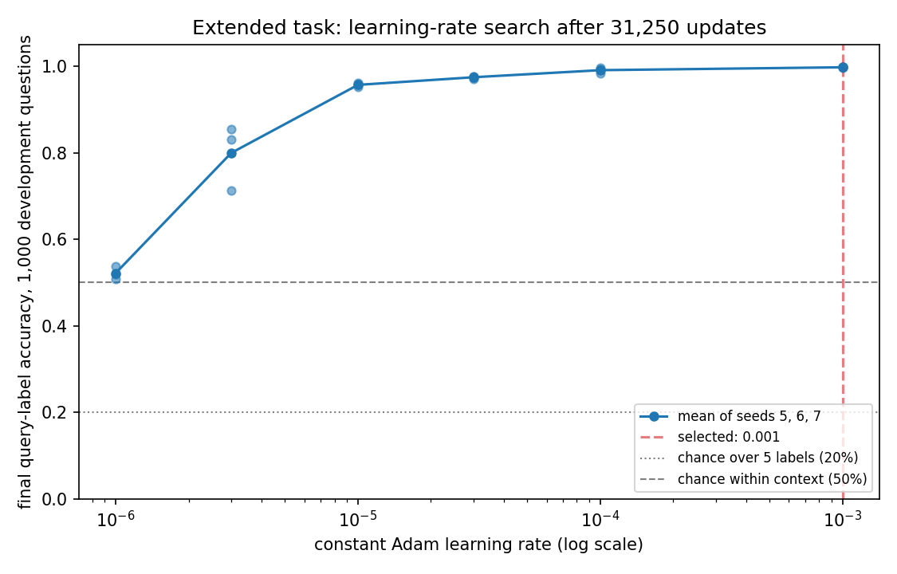

# Finding 04 — Learning rate 0.001 performed best for the extended task among the tested settings

17 September 2026 | source runs: `results/extended_task/tuning/`

## Question

The extended task had only ever been trained at the authors' 1e-05, carried over
from the base task without being tested. Before committing a set of recursive
chains — where every generation of every condition must share one fixed training
setting — we measured how several learning rates perform **on the extended task,
under our fixed settings and budget** of 1,000,000 sequences (31,250 updates).

## Setup

A grid of **six learning rates × three initialisation seeds = 18 candidates**:

- learning rates 1e-6, 3e-6, 1e-5, 3e-5, 1e-4, 1e-3
- initialisation seeds 5, 6, 7

Every candidate trains on the **original** extended task with **correct** labels:
the true query label, a fair coin flip for the next symbol, and that symbol's
true label. No generated data enters this stage.

All 18 share one training set of 1,000,000 examples — it depends on neither the
learning rate nor the initialisation seed — so every candidate sees the same
questions in the same order. Architecture, the equally weighted three-prediction
objective, constant-rate Adam and batch size 32 are identical throughout. Each
trains one pass from fresh weights and a fresh optimizer, and the **final**
checkpoint is what is compared: no early stopping, no best-checkpoint picking.

**What the initialisation seed changes is the backbone weights only.** The
two-way symbol head keeps its own fixed seed (11), and the training data, the
development coin flips and the evaluation questions are the same for all 18. The
three seeds are repeated starting conditions and give a limited picture of
initialisation variability, from three samples.

**The selection rule was fixed in the script before any result was inspected**,
written into `results/extended_task/tuning/results.json` at the start of the run,
and not revised afterwards:

1. highest unrounded mean final **query-label** development accuracy over seeds
   5, 6 and 7;
2. exact ties broken by lowest mean final query-label loss;
3. any remaining tie prefers the authors' 1e-05, otherwise the smaller rate.

A rate needs all three seeds completed to be eligible. Symbol loss and
following-label accuracy were recorded for interpretation but play **no part** in
the selection.

Scored on the unchanged fixed 1,000-question development evaluator. The reserved
final-test classes were not generated and not scored.

## Results



All 18 candidates trained to completion. None diverged, every loss stayed finite,
and there were no implementation failures. The spread column is the
**population** standard deviation of three values, not a confidence interval.

| learning rate | mean query acc | spread (pop. sd) | mean query loss | seed 5 | seed 6 | seed 7 |
| --- | ---: | ---: | ---: | ---: | ---: | ---: |
| 1e-6 | 0.5217 | 0.0116 | 0.7566 | 0.519 | 0.509 | 0.537 |
| 3e-6 | 0.7997 | 0.0621 | 0.4405 | 0.713 | 0.831 | 0.855 |
| 1e-5 (authors') | 0.9570 | 0.0041 | 0.1432 | 0.962 | 0.957 | 0.952 |
| 3e-5 | 0.9747 | 0.0026 | 0.0904 | 0.971 | 0.977 | 0.976 |
| 1e-4 | 0.9910 | 0.0051 | 0.0276 | 0.984 | 0.996 | 0.993 |
| **1e-3** | **0.9977** | 0.0005 | **0.0073** | 0.997 | 0.998 | 0.998 |

**Selected learning rate: 1e-3.**

Mean accuracy rose at every step up the tested range, by steadily smaller
amounts: 1e-6 → 1e-5 gains 43.5 percentage points, 1e-5 → 1e-3 gains 4.1. The
tested rates are unevenly spaced, so these are observed gains between the
settings tried, not a characterised curve.

### The two recorded side measures

| learning rate | mean symbol loss | mean following-label accuracy |
| --- | ---: | ---: |
| 1e-6 | 0.7009 | 0.4850 |
| 3e-6 | 0.7070 | 0.7700 |
| 1e-5 | 0.6966 | 0.9520 |
| 3e-5 | 0.6937 | 0.9737 |
| 1e-4 | 0.6937 | 0.9927 |
| 1e-3 | 0.6933 | 0.9960 |

Following-label accuracy tracks query-label accuracy closely and would have
chosen the same rate, but it was not part of the rule.

Symbol loss behaves differently, and this is the more interesting row. The
next-symbol target is a fair coin flip, so no model can do better in expectation
than learn that distribution, giving a floor of ln 2 ≈ 0.6931; on a finite
1,000-question sample an individual value can land slightly below it. Every
rate's mean sits **at or slightly above** the floor (0.6933 to 0.7070), and the
higher rates sit closer. The symbol head is therefore behaving as intended at
every usable rate, and this measure separates the candidates much less than the
label measures do, because there is very little room above the floor.

## Interpretation

**Under our fixed settings and budget, 1e-3 reached higher final development
accuracy on the extended task than the authors' 1e-5: 0.9977 against 0.9570, with
mean query loss 0.0073 against 0.1432.** That is a comparison of measured
outcomes in this configuration. It says nothing about why the authors chose their
rate or what they were optimising for, and nothing about how these rates would
compare under different settings.

The 1e-6 result is consistent with **insufficient learning within this budget**
rather than divergence: losses stayed finite, and final query accuracy was near
50% — the level a model reaches by answering within the context without reliably
picking the right one of the two labels.

**The winner is at the edge of the tested range.** The correct description is
*best among the tested rates under this training budget*, not the best learning
rate. The grid was **not** expanded upwards in response to that, by prior
agreement; `selection.json` records `winner_at_grid_boundary: true`.

**This matches what the base task found.** The base-task search also selected
1e-3 (finding 01). The two searches are separate experiments on different tasks
and the agreement is an observation, not a demonstration that one result implies
the other.

## Limitations

- **Boundary result.** 1e-3 is the top of the tested range and the search stopped
  there. 3e-4 and rates above 1e-3 were not tested, so nothing here rules out a
  better rate above 1e-3, or instability above it.
- **One budget.** Every number is specific to 31,250 updates.
- **Three initialisations, one development set**, and only the backbone varies
  with the seed. Uncertainty about other seeds, other symbol-head
  initialisations and other evaluation samples remains unquantified.
- **Selection used final checkpoints only.** Accuracy and loss were logged
  throughout training — 201 evaluation points per candidate in each `log.h5` — so
  learning curves are available. What tuning candidates lack is intermediate
  *weights*: they keep only the initialisation and final checkpoints, which
  limits retrospective mechanistic analysis, not analysis of the logged metrics.
- The reserved final-test classes have never been scored.

## Reproduce

From the project root, with the environment set up (see README):

```powershell
.\.venv\Scripts\python.exe scripts/prepare_evaluation_data.py
.\.venv\Scripts\python.exe scripts/extended_task/tune_extended.py
```

The tuning command trains any candidate without a result, scores each final
checkpoint on the 1,000-question set, applies the selection rule and writes the
figure. Finished candidates are skipped, so it is safe to stop and restart.

Measurements and figure:

- `results/extended_task/tuning/results.json` — all 18 candidates, the fixed
  settings and the selection rule as recorded before the results
- `results/extended_task/tuning/selection.json` — the rule, per-rate summaries,
  the winning rate and the seed-5 run carried forward
- `results/extended_task/tuning/learning_rate_comparison.png` — the figure above
- the one original-task training set every candidate used. It is deterministic
  from fixed seeds, so it is read from wherever it already exists rather than
  rebuilt: in this workspace all 18 candidates read the copy held by the
  extended-task generation 0 that existed at the time, and a clean reproduction
  rebuilds the identical dataset into `results/extended_task/tuning/training_data.h5`

**What this selects for the recursive experiment:** learning rate 1e-3 at
initialisation seed 5. Seed 5 was fixed in advance as the seed carried forward;
it is not the best-scoring seed — seeds 6 and 7 both reached 0.998 against seed
5's 0.997 — and was deliberately not chosen on performance. Generation 0 of the
recursive experiment was retrained at that configuration under the 55-checkpoint
policy, because tuning candidates keep only two checkpoints; see
`findings/05_label_generation_strategies.md`.

The candidate at 1e-05 and seed 5 was **not** retrained: an existing model with
exactly this configuration already existed as the earlier extended-task
generation 0, and was scored rather than trained again. When that earlier
experiment was archived, its configuration, log and its first and final
checkpoints were kept at
`results/extended_task/tuning/learning_rate_1e-05_init_seed_5/` so this search
does not depend on the archive.
