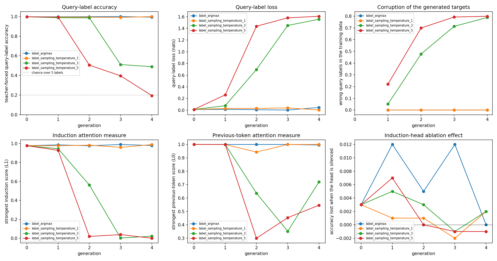

# Finding 05 — The label-generation strategy decided whether these recursive chains survived

17 September 2026 | source runs: `results/extended_task/recursive/`

## Question

> How does the synthetic-label generation strategy affect performance
> degradation and induction-circuit function across recursive generations?

And, secondarily: do attention-pattern measures, measured head-ablation effects
and predictive performance change on the same schedule, or on different ones?

Four chains of five models each share **one** generation 0 and differ only in how
the parent turns its label logits into its successor's training targets:

| condition | rule for both label predictions |
| --- | --- |
| `label_argmax` | the single most likely label |
| `label_sampling_temperature_1` | drawn from `softmax(logits / 1)` |
| `label_sampling_temperature_3` | drawn from `softmax(logits / 3)` |
| `label_sampling_temperature_5` | drawn from `softmax(logits / 5)` |

Argmax against any sampling condition compares **generation strategies**;
temperatures 1, 3 and 5 compare **temperatures within sampling**. These are two
different comparisons and are kept apart below.

## Setup

The task, model and generation procedure are unchanged from the extended task as
built earlier: two symbol–label context pairs and a query, then three predicted
outputs — the query's label, a next symbol restricted to the two already in the
context, and that symbol's label. Opening contexts come from the authors'
original generator at every generation, in every condition. Details of the
seven-token layout and the two-way symbol head are in
`findings/04_extended_task_tuning.md` and the README.

**Learning rate 1e-3**, the best of the six rates tested at this budget (finding
04) rather than a rate carried over untested. Initialisation seed 5, batch size
32, 1,000,000 examples, 31,250 updates, 55 checkpoints. **Every model starts from
fresh weights and a fresh optimizer** — a successor never inherits its parent's
parameters, so nothing about the parent's internal structure is passed on
directly. What passes between generations is the training data.

**Generation 0 is trained once and shared by all four conditions.** Its final
development scores agree with its tuning candidate at the same configuration to
four decimal places on all four measures (query accuracy 0.9970, query loss
0.0114, symbol loss 0.6934, following-label accuracy 0.9960). That is expected —
same settings, same deterministic data, differing only in how many checkpoints
were kept — and we did not compare the two models' parameters, so this is
agreement on four reported measures rather than established identity. No material
discrepancy.

**How a successor's data is made.** Autoregressively, one token at a time, each
step conditioned on what the parent actually produced, mistakes kept and never
corrected:

1. the **query label** — argmax, or sampled from `softmax(logits / T)`;
2. the **next symbol** — always sampled from the two-way head at temperature 1,
   in **every** condition;
3. the **following label** — by the same rule as step 1.

Temperature divides the **logits** before the softmax; no already-normalised
probability is rescaled, and all five labels stay eligible at every temperature.
Because generation is autoregressive, the sampled query label is fed back in
before the symbol is chosen, so the symbol probabilities differ between
conditions even though the symbol rule is identical.

Temperature applies **only** to making a successor's training data — not to the
training loss, the evaluation decoding, or generation 0's data.

Every model is scored on the same fixed 1,000-question development evaluator with
the same procedure. Two different sampling densities matter throughout:

- **query accuracy and loss** are logged every 5,000 sequences, giving **201
  points** per run;
- **attention measures and ablations** are computed at **12 of the 55 saved
  checkpoints**, the same 12 in every model (0; 1,024; 2,016; 5,024; 10,016;
  20,000; 40,000; 80,000; 160,000; 280,000; 540,000; 1,000,000).

Statements about attention are therefore limited to those 12 points; we never
observed the 43 checkpoints in between. The reserved final-test classes were not
generated or scored.

## Results



### What the parents wrote down — a property of the datasets, not of any model

Wrong labels among each successor's 1,000,000 training examples, measured against
the original context mapping. These describe **the data a successor was given**;
how that successor then performed is a separate measurement, reported after.
Counts, with rates in parentheses:

| data for gen | argmax | T = 1 | T = 3 | T = 5 |
| --- | ---: | ---: | ---: | ---: |
| 1 | 0 (0.000000) | 48 (0.000048) | 50,802 (0.050802) | 220,940 (0.220940) |
| 2 | 0 (0.000000) | 108 (0.000108) | 477,839 (0.477839) | 699,572 (0.699572) |
| 3 | 0 (0.000000) | 140 (0.000140) | 713,796 (0.713796) | 792,942 (0.792942) |
| 4 | 13 (0.000013) | 401 (0.000401) | 788,744 (0.788744) | 799,069 (0.799069) |

Following-label errors behave the same way (argmax 0 → 14; T=1 72 → 489;
T=3 61,889 → 790,744; T=5 259,894 → 798,680).

Corruption rises with temperature and accumulates across generations. At T=5 the
error rate reaches 0.799 by generation 4, close to the 0.8 that uniform guessing
over five labels would produce.

The **context-position** preference stayed near a coin flip in every condition
and generation (0.477–0.502, against 0.4994 in generation 0's own correct data),
with no trend.

The **symbol-identity** spread is a different measurement, and it barely moved.
Counting which of the 50 training classes the parent actually selected as the
next symbol: all 50 appear in every generated dataset; the largest single class
share runs from 0.02026 (generation 0's correct data) to 0.02050 (temperature 3,
generation 4); and the class entropy runs from 3.912006 down to 3.911970 nats,
against a maximum of ln 50 = 3.912023. Frequencies therefore stayed very close to
even everywhere, with the largest departure in the most corrupted temperature-3
dataset. These differences are small and we did not test whether they are
distinguishable from sampling variation.

Retaining all 50 classes would not on its own have shown that the frequencies
were unchanged, which is why the share and the entropy are reported as well. Nor
is a near-even spread forced by the design: the parent chooses between the two
symbols already in the context, and both context slots are filled by classes
drawn evenly from the 50, but a parent whose symbol head favoured particular
symbol identities could still have skewed the result. In these runs it did not
measurably do so.

### What the successors learned

Teacher-forced development scores at each final checkpoint, on the same fixed
1,000 questions:

| gen | argmax acc / loss | T=1 acc / loss | T=3 acc / loss | T=5 acc / loss |
| --- | ---: | ---: | ---: | ---: |
| 0 (shared) | 0.997 / 0.011 | 0.997 / 0.011 | 0.997 / 0.011 | 0.997 / 0.011 |
| 1 | 0.997 / 0.013 | 0.994 / 0.028 | 0.988 / 0.076 | 0.994 / 0.262 |
| 2 | 0.998 / 0.008 | 0.993 / 0.030 | 0.986 / **0.696** | **0.505** / 1.437 |
| 3 | 1.000 / 0.002 | 0.991 / 0.038 | **0.511** / 1.451 | **0.396** / 1.581 |
| 4 | 0.993 / 0.046 | 0.999 / 0.003 | **0.489** / 1.556 | **0.194** / 1.608 |

**Argmax and temperature-1 sampling showed no degradation over these four
generations.** Both stay between 0.991 and 1.000 with no trend; argmax reached
1.000 at generation 3 and 0.993 at generation 4, temperature 1 reached its
highest value, 0.999, at generation 4. These are movements of a few questions out
of the same fixed 1,000. Every generation answered the *same* questions, so these
are paired differences on a shared set; we did not carry out a test of whether
they are distinguishable from chance variation, and a single model's standard
error would not be the right basis for one. This is stability across generations
1–4 of these two chains, at this seed and budget — not a claim that these
strategies cannot degrade a model.

**Temperature 3 and temperature 5 both collapsed**, at different generations:
temperature 5 between generations 1 and 2, temperature 3 between generations 2
and 3. Temperature 5 ends at 0.194 on these 1,000 questions, close to the 0.2 that
uniform guessing over five labels gives.

**Self-generated continuations agree with the teacher-forced scores.** Letting
each model condition on its own output gives the same query-label accuracy to
three decimals in every case — necessarily, since nothing the model generates
precedes the query label — and a following-label accuracy within about 0.02 of
the teacher-forced figure (e.g. T=3 generation 4: 0.456 teacher-forced, 0.439
generated). The collapse is not an artefact of teacher forcing.

**The symbol output did not deteriorate in any condition.** Symbol loss stays
between 0.6897 and 0.6949 — within 0.004 of ln 2 ≈ 0.6931, the best value
achievable against a fair coin flip. Individual values fall a little either side;
the development target is a fixed coin flip scored on 1,000 questions, so small
excursions below the floor are what sampling variation looks like rather than
evidence of beating it. This holds even at temperature 5 generation 4, where the
labels are at chance.

### Where deterioration is clearest, and where we did not look

Clearest in the **query-label loss**, which moves earliest and furthest: at
temperature 3 it rises 0.011 → 0.076 → 0.696 while accuracy is still 0.986, and
at temperature 5 it reaches 0.262 at generation 1 while accuracy is still 0.994.
Also clear in the **induction attention measure** and in the **corruption of the
generated targets**.

It is not visible in the symbol loss, in the context-position preference, or —
beyond the fifth decimal place — in the symbol-identity spread. Those are the
measurements we took, and they did not move; that is not evidence that every
aspect of these models is unaffected, only that these measures are not where the
change shows.

### Attention measures

Strongest score over the eight heads, each model measured on its own final
checkpoint. These are **attention-pattern measurements**: they describe where
heads attend, not what a head contributes to the output.

| gen | argmax induction / prev-token | T=1 | T=3 | T=5 |
| --- | ---: | ---: | ---: | ---: |
| 0 | 0.977 / 1.000 | 0.977 / 1.000 | 0.977 / 1.000 | 0.977 / 1.000 |
| 1 | 0.986 / 1.000 | 0.977 / 1.000 | 0.946 / 1.000 | 0.929 / 0.999 |
| 2 | 0.977 / 1.000 | 0.983 / 0.943 | **0.562 / 0.636** | **0.019 / 0.300** |
| 3 | 0.991 / 1.000 | 0.960 / 1.000 | **0.002 / 0.352** | **0.038 / 0.453** |
| 4 | 0.979 / 0.996 | 0.990 / 1.000 | **0.021 / 0.721** | **0.000 / 0.546** |

The previous-token score is non-monotone in the collapsed chains — 0.636 → 0.352
→ 0.721 at temperature 3 — so it does not simply follow the induction score down.

### Head ablations

Reported effects are differences in query-label accuracy, **intact minus
ablated**, expressed in percentage points. A **positive** value means silencing
that head *reduced* accuracy.

Silencing the single highest-scoring **induction** head changed accuracy by
between −0.2 and +1.2 percentage points in every model of every condition. In
generation 0 it cost 0.3 points (0.997 → 0.994).

Silencing the single highest-scoring **previous-token** head did considerably
more in some models: +0.9 points in generation 0, rising to +7.0 in argmax
generation 4, and reaching **+20.0** and **+29.1** points at temperature 1
generations 2 and 4 (0.993 → 0.793 and 0.999 → 0.708). In both of those the head
silenced was L0H7. We have not investigated why that head matters so much more in
some runs than in others.

In the collapsed models every ablation effect is within ±0.3 points. That is
uninformative rather than reassuring: intact accuracy is already near chance, so
there is little performance left for an intervention to remove.

Single-head ablation is therefore **not** uniformly uninformative here — it is
small for the selected induction head and sometimes large for the selected
previous-token head. What it does not establish is redundancy. A small effect
from silencing one head is equally consistent with other heads compensating, with
the behaviour not depending on that head, and with zero-ablation being too weak
an intervention to reveal a dependency that exists. We did not silence heads in
combination, so nothing here distinguishes those explanations. Likewise, seven of
the eight layer-1 heads scoring above 0.66 on the induction measure in generation
0 is an observation about attention patterns; it does not by itself establish
that the behaviour is distributed across them.

Head identities are recorded in every `analysis.json` and are selected from each
model's own final scores. They stayed at L1H2 throughout the argmax chain but
moved in the sampling chains — induction L1H2 → L1H4 → L1H7 at temperature 1, and
L1H2 → L1H0 → L1H6 → L1H7 at temperature 3. The previous-token head moved from
L0H1 to L0H7 after generation 0 in three of the four chains. **Where the identity
changes, consecutive rows describe different heads and are not a like-for-like
series.**

### What the within-training curves show

Query accuracy is logged 201 times per run; the attention measures exist only at
the 12 analysed checkpoints.

In the two stable conditions the models reach high accuracy early and stay there.
Generation 0 first crosses 90% at 30,016 sequences and is above 90% at 97% of its
logged evaluation points. The argmax and temperature-1 successors first cross
between 50,016 and 65,024 sequences — inside the first 7% of their million
examples — and are above 90% at about 94% of logged points. A first recorded
crossing of 90% is an operational marker on a logged curve, not the moment a
circuit forms:

| condition | gen 1 | gen 2 | gen 3 | gen 4 |
| --- | ---: | ---: | ---: | ---: |
| argmax | 60,000 | 55,008 | 55,008 | 50,016 |
| T = 1 | 65,024 | 60,000 | 55,008 | 60,000 |
| T = 3 | 150,016 | **560,000** | not reached | not reached |
| T = 5 | 225,024 | not reached | not reached | not reached |

In the runs marked "not reached", accuracy never exceeded 0.543 at any of the 201
logged points. They do not all behave alike:

- **Temperature 3, generation 3** moves between 0.21 and 0.53 across the analysed
  checkpoints and finishes at 0.511 — near the level reached by answering within
  the context without reliably choosing between the two labels.
- **Temperature 5, generations 3 and 4** sit much lower, finishing at 0.396 and
  0.194. Generation 4 ranges from 0.070 to 0.366 across its logged points; 0.194
  is about what uniform guessing over five labels gives, and 0.070 is below it.

That difference carries information. A successor whose targets were 79.9% wrong
was trained towards a nearly uniform label distribution, and scoring at or below
five-way chance against the *true* labels is what that would look like. The
proposed explanation — which this experiment does not test directly — is that
these models did not simply fail to learn, but learned targets that no longer
carry the context mapping.

Across those same runs the induction score stayed below 0.05 at **every one of
the 12 analysed checkpoints**, starting from 0.005 at initialisation. We did not
measure the 43 checkpoints in between, so we cannot say the pattern never
appeared at any point during training — only that it was absent whenever we
looked, while accuracy, sampled 201 times, never rose.

## Interpretation

**The label-generation strategy decided the outcome in these runs, and the
quantity that tracks it is how badly the targets were corrupted.** Argmax and
temperature-1 sampling corrupted at most 0.04% of targets and produced no
degradation over four generations. Temperature 3 and temperature 5 corrupted 5%
and 22% at the first step, accumulating past 78% by generation 4, and both chains
collapsed — the higher temperature one generation earlier. That association holds
across the four conditions we ran; with one chain per condition it is not a
dose–response curve.

**What we can and cannot say about the circuit.** Each successor starts from
fresh weights, so there is no inherited circuit for recursion to erode; the
question is whether each successor *develops* the induction attention pattern
during its own training. In the two stable conditions it did, early. In the
collapsed runs the induction score was below 0.05 at all 12 analysed checkpoints
and accuracy never exceeded 0.543 at any of 201 logged points, so on the evidence
we have the pattern did not develop within this budget. Two limits on that
statement: we did not observe the checkpoints in between, and an attention score
measures where heads attend rather than what the circuit contributes to the
output. "The induction circuit stopped functioning" is an interpretation of these
measurements, not something they establish.

**The clearer signal is the delay.** Temperature 3 first crossed 90% at 150,016
sequences in generation 1, at 560,000 in generation 2, and not at all in
generations 3 and 4. A proposed explanation, which this experiment does not test,
is that corrupted targets weaken the statistical regularity the induction pattern
depends on. Whether a longer budget would change the outcome was not tested, and
these data do not indicate either way.

**On whether the circuit changes before performance: not established.** Within
training, accuracy and the induction score rise together at the transition in the
stable runs and stay low together in the collapsed ones. Across generations both
change within the same observed interval in every collapsed chain, so the
ordering remains unresolved. The one partial dissociation is that query *loss*
moves earlier and further than accuracy — temperature 5 generation 1 has loss 23×
its parent's while accuracy is still 0.994, and temperature-3 generation 2 ends
at near-parent accuracy with a much lower induction score. Those quantities are
on different scales, and comparing their relative percentage changes would not
establish which deteriorated first.

**Accuracy, loss, target corruption and the diversity measures answer different
questions** and did not move together: loss moved before accuracy, target
corruption led both, symbol loss did not move, and the symbol-identity spread
moved only in the fifth decimal place.

## Limitations

- **One chain per condition, from one shared parent.** Four chains sharing
  generation 0 are not four independent replications. One initialisation seed,
  one training budget, one development set, one learning rate.
- **Argmax vs sampling and temperature vs temperature are separate comparisons.**
  An argmax-to-temperature-3 difference does not isolate temperature.
- **The budget is part of every result.** "Did not develop" means within 31,250
  updates at these settings. Whether longer training would change any collapsed
  run is untested, and these data do not indicate either way.
- **Attention coverage is sparse.** 12 of 55 checkpoints for the attention
  measures and ablations, against 201 logged points for accuracy and loss. No
  claim is made about what happened between the analysed checkpoints.
- **Head identity changed within the sampling chains**, so those ablation series
  are not like-for-like.
- **Ablation is single-head, zero-ablation, on one evaluator.** It establishes
  neither the circuit's importance nor its redundancy.
- **All results are on a 1,000-question sample** drawn from 100 held-out classes,
  not over the whole question distribution.
- **1e-3 is the best of the six rates tested at this budget** (finding 04) and
  sits at the top of that range. The earlier 1e-05 experiment, retired from the
  maintained project, measured much larger induction-head ablation effects, so
  the effect sizes here should not be read as properties of the architecture.
- The reserved final-test classes have never been scored.

## Reproduce

From the project root, with the environment set up (see README):

```powershell
.\.venv\Scripts\python.exe scripts/extended_task/tune_extended.py
.\.venv\Scripts\python.exe scripts/extended_task/run_extended.py --generations 4
.\.venv\Scripts\python.exe scripts/extended_task/run_extended.py --label-strategy sample --label-temperature 1 --generations 4
.\.venv\Scripts\python.exe scripts/extended_task/run_extended.py --label-strategy sample --label-temperature 3 --generations 4
.\.venv\Scripts\python.exe scripts/extended_task/run_extended.py --label-strategy sample --label-temperature 5 --generations 4
.\.venv\Scripts\python.exe scripts/extended_task/analyse_extended.py --condition label_argmax
.\.venv\Scripts\python.exe scripts/extended_task/analyse_extended.py --condition label_sampling_temperature_1
.\.venv\Scripts\python.exe scripts/extended_task/analyse_extended.py --condition label_sampling_temperature_3
.\.venv\Scripts\python.exe scripts/extended_task/analyse_extended.py --condition label_sampling_temperature_5
.\.venv\Scripts\python.exe scripts/extended_task/analyse_extended.py --compare-conditions
```

The first recursive command trains the shared generation 0 and the argmax chain;
the rest reuse that generation 0. Finished generations are skipped, and a run
trained at a different learning rate is refused rather than reused.

Measurements and figures:

- `results/extended_task/recursive/condition_comparison.json` and `.png` — the
  four conditions side by side
- `results/extended_task/recursive/experiments/<condition>/generation_comparison.json`
  and `.png` — one chain's table and figure, including its within-training curves
- `.../generation_<n>/analysis.json` — development scores teacher-forced and
  self-generated, per-head attention measures, the selected heads, their ablation
  effects, and the 12-checkpoint trajectory
- `.../generation_<n>/dataset_quality.json` — what the parent generated, as
  counts and rates, with position and symbol-identity measures kept apart
- `.../generation_<n>/log.h5` — the 201-point learning curves the transition
  table is read from
- `results/extended_task/recursive/generation_0/` — the shared parent

Seeds are recorded in each generation's `config.json`: symbol-head initialisation
11, generation-0 coin flips 12, development coin flips 13, next-symbol sampling
14, label sampling 15.
