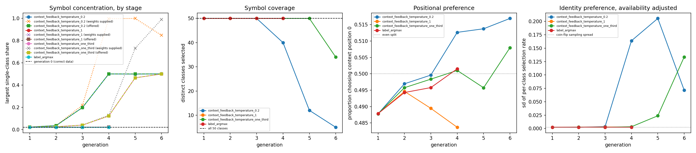
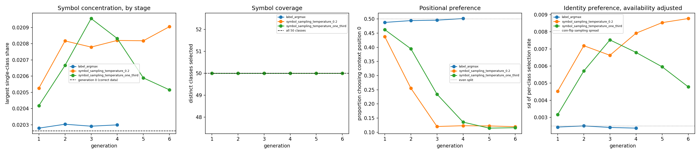

# Finding 06 — Feeding symbols back, and choosing them more sharply: two symbol-side interventions

18 September 2026 | source runs: `results/extended_task/recursive/`

## Question

Finding 05 degraded these chains by corrupting the **labels** a parent wrote
down. These two families use argmax for both label outputs and change the
**symbols** instead:

- **Context feedback**: each child's opening questions are built from the
  frequencies of the symbols its parent actually generated, sharpened at context
  temperature 1, 1/3 or 0.2.
- **Next-symbol temperature**: the parent picks between the two context symbols
  at temperature 1/3 or 0.2 instead of 1, on unchanged original questions.

With finding 05's label family that makes three families, all sharing one
generation 0 and one reference condition: **`label_argmax`** — original opening
questions, argmax labels, next symbol sampled at temperature 1.

**On the word "collapse".** Three different things are measured here and they do
not move together, so this finding never uses "collapse" unqualified. Each time,
it names which measured behaviour deteriorated: *query-label accuracy*,
*following-label accuracy*, *symbol loss*, *symbol-identity concentration*,
*symbol coverage*, or *positional preference*.

## Setup

Task, model and training are unchanged: learning rate 1e-3 (finding 04),
initialisation seed 5, batch size 32, 1,000,000 examples, 31,250 updates, fresh
weights and a fresh optimizer per model, 55 checkpoints. A parent supplies its
child's training data; its weights are never used to initialise the child.
Generation 0 is the same model in every condition of every family and was not
retrained.

**Chain lengths differ, by design.** The reference and context temperature 1 stop
at generation 4. The four chains below were extended to **generation 6**:
context feedback at temperatures 1/3 and 0.2, and next-symbol temperature 1/3 and
0.2. Nothing is extrapolated for the shorter chains, and the figures show them
ending where they end.

Every model is scored on the same fixed 1,000-question development evaluator
drawn from the **original** task distribution, deliberately not adjusted to match
a condition's training distribution. Attention measures and ablations use 12 of
the 55 checkpoints; accuracy and loss are logged 201 times per run.

### The context-feedback rule, and its four distinct stages

At each parent-to-child transition:

1. **Parent-generated frequencies.** The parent is replayed over the openings in
   its *own* saved training set and the identities of the next symbols it
   produces are counted into frequencies `p`. These are outputs the parent
   generated, not targets it inherited.
2. **Sampling weights.** `w ∝ p ** (1 / T)`, normalised. **This step explicitly
   sharpens the measured frequencies**: temperature 1 leaves them as measured,
   1/3 cubes them, 0.2 raises them to the fifth power. The concentration reported
   below is produced by that exponent — an intervention we imposed — not by a
   preference the models developed. No softmax over counts, no smoothing, no
   floor, no class removal by hand.
3. **Symbols offered.** The generator builds ordinary valid questions from `w`:
   two **distinct** context classes drawn without replacement, unchanged label
   pairs, query construction and exemplar rules.
4. **Symbols selected.** The same parent generates the child's training
   continuations on those questions, argmax labels, next symbol at temperature 1.

Stages 2, 3 and 4 are different quantities and are never conflated below.

## Results

### Context feedback: the weights concentrate; what is offered is capped at half



Largest single-class share at each stage:

| condition | gen | weights supplied | offered | selected | classes selected | chosen entropy |
| --- | --- | ---: | ---: | ---: | ---: | ---: |
| reference | 4 | — | 0.0203 | 0.0203 | 50 | 3.9120 |
| T = 1 | 4 | 0.0215 | 0.0216 | 0.0216 | 50 | 3.9115 |
| T = 1/3 | 4 | 0.1291 | 0.1221 | 0.1216 | 50 | 3.6071 |
| T = 1/3 | 5 | 0.7303 | 0.4654 | 0.4648 | 50 | 2.3053 |
| T = 1/3 | 6 | 0.9905 | 0.5000 | 0.4990 | 34 | 1.5820 |
| T = 0.2 | 4 | 0.9967 | 0.5000 | 0.5001 | 40 | 1.8404 |
| T = 0.2 | 5 | 0.9990 | 0.5000 | 0.4987 | 12 | 1.1604 |
| T = 0.2 | 6 | 0.8473 | 0.5000 | 0.5009 | **5** | 0.6944 |

**A sampling weight is not a generated frequency.** At temperature 0.2
generation 4 one class held 0.9967 of the sampling weight, but that class was
**not** 99.67% of the generated symbols: it appeared in 0.5000 of the offered
context slots and was selected 0.5001 of the time. The two context classes must
differ, so however concentrated the weights become, the dominant class can fill
only one of the two slots — the offered and selected shares are capped near 0.5,
and they stay there from temperature 0.2 generation 4 onward. The three stages
are plotted separately in the left panel for exactly this reason.

**Coverage is where the compounding shows.** The number of distinct classes
selected in a million examples falls 50 → 40 → 12 → 5 along the temperature-0.2
chain, and 50 → 50 → 34 along temperature 1/3. Chosen-class entropy falls from
3.9120 nats to 0.6944.

**Classes leave the pool through a finite sample, and the rule then makes that
permanent.** A class that happens not to be selected in one million examples gets
measured frequency exactly 0, so `p ** (1/T)` is exactly 0 and it can never be
offered again in that chain. That is a property of the rule applied to a finite
sample — it is **not** evidence that the parent assigned that class zero
probability, and we did not measure the parent's probabilities. By generation 6,
12 of 50 classes had non-zero weight at temperature 0.2 and 50 of 50 at
temperature 1/3 (the smallest being 2.2 × 10⁻¹⁴, tiny but non-zero).

**No condition stopped.** The pipeline halts a chain if fewer than two classes
have positive weight; every generation here kept at least 12, so all four chains
ran to generation 6 under the unmodified rule.

Two things did not move in this family: the **context-position split** stayed
between 0.484 and 0.517 across all generations, and the sharpening never produced
a positional bias.

The availability-adjusted identity measure reads 0.00 to 0.21 across these
chains, but it is not interpretable once the weights are extreme: when one class
is offered a million times and others a handful, the per-class rates for rare
classes are dominated by sampling noise. It is reported for completeness rather
than read as a preference.

### Context feedback: query-label accuracy held, then fell — later than four generations would suggest

| condition | gen | query acc / loss | following acc | induction | prev-token |
| --- | --- | ---: | ---: | ---: | ---: |
| reference | 4 | 0.993 / 0.046 | 0.997 | 0.979 | 0.996 |
| T = 1 | 4 | 0.992 / 0.030 | 0.995 | 0.981 | 0.997 |
| T = 1/3 | 4 | 0.997 / 0.007 | 0.995 | 0.970 | 1.000 |
| T = 1/3 | 5 | 0.974 / 0.112 | 0.973 | 0.929 | 1.000 |
| T = 1/3 | 6 | **0.410 / 2.474** | **0.399** | **0.129** | 1.000 |
| T = 0.2 | 3 | 0.994 / 0.018 | 0.996 | 0.979 | 1.000 |
| T = 0.2 | 4 | **0.535 / 5.551** | **0.497** | **0.161** | 0.904 |
| T = 0.2 | 5 | 0.615 / 4.676 | 0.592 | 0.253 | 0.996 |
| T = 0.2 | 6 | 0.526 / 5.630 | 0.544 | 0.159 | 1.000 |

**Extending the chains changed the conclusion.** At four generations,
temperature 1/3 looked stable — 0.997 query accuracy at generation 4, better than
the reference. It then fell to 0.974 at generation 5 and **0.410** at generation
6. Any claim that a condition is stable is therefore a claim about the
generations actually run, and this family shows how quickly that can be
overturned by two more.

**Temperature 0.2 did not keep falling; it fluctuated.** After dropping to 0.535
at generation 4 it went *up* to 0.615 at generation 5 and back to 0.526 at
generation 6 — a plateau between roughly 0.52 and 0.62 rather than a continuing
decline toward chance. Its previous-token score also returned to 0.996 and 1.000
at generations 5 and 6 after reading 0.904 at generation 4, while its induction
score stayed low (0.253, 0.159).

**This deterioration happened with almost entirely correct labels.** Exact wrong
query-label counts per 1,000,000 examples along these two chains:

| condition | g1 | g2 | g3 | g4 | g5 | g6 |
| --- | ---: | ---: | ---: | ---: | ---: | ---: |
| T = 1/3 | 0 | 0 | 0 | 0 | 0 | 0 |
| T = 0.2 | 0 | 0 | 19 | 0 | 0 | 5 |

The temperature-1/3 chain is the one case in this project where **every** dataset
in a chain contained exactly zero wrong query labels and zero wrong following
labels, across all six generations — and its query accuracy still fell to 0.410.
The temperature-0.2 chain had zero errors in four of its six datasets, 19 in the
third and 5 in the sixth. Elsewhere in this family, context temperature 1 reached
618 wrong query labels at generation 3 (0.062%), so "all labels correct" is not
true of the family as a whole and is stated per dataset.

What that establishes is narrow: these chains deteriorated on the label outputs
while being trained on targets that were almost all correct, so corrupted targets
cannot be the explanation here. It does **not** establish that symbol
concentration caused the fall. Concentration, coverage loss and the accuracy drop
move together in these chains, but with one chain per condition and the drop
appearing at a single generation in each, nothing here separates them or rules
out another factor.

How much of the accuracy figure is distribution shift also matters. These
children trained almost entirely on questions built from a handful of symbols and
were scored on the original evenly-drawn questions. The score therefore measures
performance on the original distribution, which is what we set out to measure; we
did not score them on their own training distribution, so it is not evidence
about what they can do on the data they saw.

### Next-symbol temperature: a positional preference that plateaus, and a symbol output that keeps degrading



Share of generated continuations choosing context position 0:

| condition | g1 | g2 | g3 | g4 | g5 | g6 |
| --- | ---: | ---: | ---: | ---: | ---: | ---: |
| reference (T = 1) | 0.488 | 0.494 | 0.496 | 0.502 | — | — |
| T = 1/3 | 0.462 | 0.395 | 0.235 | 0.136 | 0.115 | 0.116 |
| T = 0.2 | 0.438 | 0.256 | 0.120 | 0.122 | 0.120 | 0.120 |

**Positional preference moved a great deal and then plateaued**, settling near
0.12 in both chains rather than continuing toward 0. **Symbol-identity
concentration did not move at all**: opening questions are unchanged here, so the
largest offered share stays at 0.0203 in every dataset, the largest selected
share stays between 0.0205 and 0.0209, chosen-class entropy stays at 3.9118–3.9120
against the reference's 3.9120, and all 50 classes are selected in every one of
the six generations. These two families therefore separate positional bias from
identity concentration cleanly: this one produces the first and none of the
second.

| condition | gen | query acc | following acc | symbol loss | induction | prev-token |
| --- | --- | ---: | ---: | ---: | ---: | ---: |
| reference | 4 | 0.993 | 0.997 | 0.6930 | 0.979 | 0.996 |
| T = 1/3 | 4 | 0.995 | 0.991 | 1.9546 | 0.957 | 1.000 |
| T = 1/3 | 5 | 0.992 | 0.987 | 3.1542 | 0.907 | 0.957 |
| T = 1/3 | 6 | 0.993 | 0.961 | 4.1266 | 0.910 | 0.998 |
| T = 0.2 | 3 | 0.991 | 0.971 | 2.8528 | 0.936 | 0.995 |
| T = 0.2 | 4 | 0.991 | **0.898** | 4.3825 | 0.823 | 0.898 |
| T = 0.2 | 5 | 0.989 | 0.935 | 5.4698 | 0.792 | 0.702 |
| T = 0.2 | 6 | 0.997 | 0.940 | 5.7462 | **0.646** | 0.685 |

**The two label outputs behaved differently, and it is wrong to describe them
together as intact.** Query-label accuracy did stay high throughout both chains
(0.989–0.997). Following-label accuracy did not: at temperature 0.2 it fell to
**0.898** at generation 4 — almost ten percentage points below the reference's
0.997 — before recovering to 0.935 and 0.940, and at temperature 1/3 it drifted
down to 0.961 by generation 6. The following label is the output that depends on which
symbol was chosen, so it is the label output exposed to a skewed symbol choice.

**The symbol output degraded continuously and did not plateau.** Symbol loss rose
from ln 2 ≈ 0.693 to 4.13 (T = 1/3) and 5.75 (T = 0.2) nats. The development
target for that output is a fair coin flip, so ln 2 is the best achievable value;
a loss of 5.75 means the model commits confidently to one position against a
random target. That is the model reproducing a training distribution in which its
parent chose position 1 about 88% of the time, then being scored on the original
one.

**Attention scores and predictive performance came apart here.** Along the
temperature-0.2 chain the strongest induction score fell 0.977 → 0.823 → 0.792 →
0.646 and the previous-token score fell to 0.685, while query-label accuracy went
*up*, ending at 0.997 — its highest value in the chain. Whatever the induction
score is tracking, it is not query-label performance in this condition. These are
attention-pattern measurements — where heads attend — and this dissociation is a
concrete reason not to read them as measurements of circuit function.

### Head ablations

Effects are intact minus ablated query accuracy in percentage points; positive
means silencing the head reduced accuracy. Silencing each model's strongest
induction head changed query accuracy by between −0.2 and +3.5 points anywhere in
these five conditions, including in the runs whose accuracy had fallen. Silencing
the strongest previous-token head ranged much wider and erratically, from under 1
point to +41.3 at context temperature 0.2 generation 1. We have not investigated
what drives that range.

Selected head identities move between generations in most of these chains, so
consecutive rows in an ablation series often describe different heads and are not
like-for-like. A small ablation effect is consistent with other heads
compensating, with the behaviour not depending on that head, and with
zero-ablation being too weak an intervention to reveal a dependency; we never
silenced heads in combination, so nothing here distinguishes those or establishes
redundancy.

## Interpretation

**Feedback alone is nearly inert; the sharpening does the work.** At context
temperature 1 the measured frequencies are reused unchanged and after four
generations the largest class weight has moved from 0.0203 to 0.0215, with no
effect on any performance measure. Every substantial change in that family comes
from the exponent we imposed at stage 2. Describing the concentration as a
preference the models developed would be wrong.

**Four generations were not enough to characterise these chains.** Temperature
1/3 looked stable at generation 4 and had fallen to 0.410 query accuracy by
generation 6; temperature 0.2 fell at generation 4 and then fluctuated between
0.52 and 0.62 rather than continuing down. Both conclusions — the later decline
and the plateau — needed the extra generations, and neither says anything about
generation 7.

**The two families deteriorate in different measured behaviours.** Context
feedback leaves positional preference alone and eventually reduces query-label
and following-label accuracy, with symbol coverage falling to 5 classes.
Next-symbol temperature leaves symbol identity alone, produces a large positional
preference that plateaus near 0.12, degrades the symbol output without bound in
the observed range, dents the following label, and leaves query-label accuracy
untouched. Concentration, positional bias and predictive performance are separate
measurements and these two interventions move different subsets of them.

**None of this identifies a mechanism.** In the context family, concentration,
coverage loss and the accuracy fall occur in the same chains, and the labels were
almost all correct, which rules corrupted targets out as an explanation *here*.
It does not follow that concentration caused the fall: one chain per condition,
one seed, one budget, and the fall appears at a single generation in each chain.

## Limitations

- **One chain per condition, from one shared parent**, at one initialisation
  seed, one budget, one learning rate. Not replications.
- **The sharpening is an imposed intervention**, so the amplification should not
  be read as a learned model preference.
- **Conclusions are scoped to the generations actually run** — six for the four
  extended chains, four for the reference and context temperature 1. The
  reference was not extended and nothing about it is extrapolated.
- **The evaluator is the original distribution by design**, so the
  context-feedback scores measure performance on the original questions, not on
  the training distribution those models saw, which was not scored.
- **A class absent from a finite dataset receives exactly zero weight** under this
  rule and is then never offered again in that chain. That is the rule acting on
  a finite sample, not a measurement that the model assigns it zero probability.
- **The availability-adjusted identity measure is uninterpretable under extreme
  imbalance**, as in the late context-feedback generations.
- **All measurements are empirical frequencies of generated tokens**, not the
  models' predicted probability vectors; recovering those would need fresh
  inference over the saved checkpoints.
- **Attention coverage is sparse** — 12 of 55 checkpoints — against 201 logged
  points for accuracy and loss, and head identities move between generations.
- **Unexplained and recorded, not interpreted**: why the previous-token ablation
  effect ranges from under 1 to 41 percentage points; why the temperature-0.2
  context chain partially recovers at generation 5; why the symbol-temperature
  chains reach 90% query accuracy earlier each generation.
- All results are on a 1,000-question sample from 100 held-out classes. The
  reserved final-test classes have never been scored.

## Reproduce

From the project root, with the environment set up and the tuning step done (see
README). `--generations` names the **final** generation, so a finished chain is
extended by raising it; completed generations are loaded as parents, not
retrained:

```powershell
.\.venv\Scripts\python.exe scripts/extended_task/run_extended.py --context-temperature 1 --generations 4
.\.venv\Scripts\python.exe scripts/extended_task/run_extended.py --context-temperature 1/3 --generations 6
.\.venv\Scripts\python.exe scripts/extended_task/run_extended.py --context-temperature 0.2 --generations 6
.\.venv\Scripts\python.exe scripts/extended_task/run_extended.py --next-symbol-temperature 1/3 --generations 6
.\.venv\Scripts\python.exe scripts/extended_task/run_extended.py --next-symbol-temperature 0.2 --generations 6
```

Then analyse each condition and compare each family against the reference:

```powershell
.\.venv\Scripts\python.exe scripts/extended_task/analyse_extended.py --condition context_feedback_temperature_1
.\.venv\Scripts\python.exe scripts/extended_task/analyse_extended.py --condition context_feedback_temperature_one_third
.\.venv\Scripts\python.exe scripts/extended_task/analyse_extended.py --condition context_feedback_temperature_0.2
.\.venv\Scripts\python.exe scripts/extended_task/analyse_extended.py --condition symbol_sampling_temperature_one_third
.\.venv\Scripts\python.exe scripts/extended_task/analyse_extended.py --condition symbol_sampling_temperature_0.2
.\.venv\Scripts\python.exe scripts/extended_task/analyse_extended.py --compare-family context
.\.venv\Scripts\python.exe scripts/extended_task/analyse_extended.py --compare-family symbol
```

Measurements and figures:

- `results/extended_task/recursive/context_feedback_comparison.json` / `.png` and
  `symbol_sampling_comparison.json` / `.png` — each family beside the reference
- `results/extended_task/recursive/context_feedback_distributions.png` and
  `symbol_sampling_distributions.png` — the figures above
- `.../experiments/<condition>/dataset_distributions.json` — per generation: the
  parent's measured frequencies and the sampling weights derived from them, the
  per-class offers, selections and selection rates, coverage and concentration,
  the position split, and the generated-label breakdown
- `.../experiments/<condition>/generation_<n>/config.json` — the settings that
  produced that run, including the `context_feedback` record of measured
  frequencies and sampling weights
- `.../experiments/<condition>/generation_comparison.json` / `.png` — one chain's
  table, figure and within-training curves

Seeds recorded in each `config.json`: symbol-head initialisation 11, generation-0
coin flips 12, development coin flips 13, next-symbol sampling 14, label sampling
15, context-feedback frequency pass 16.
